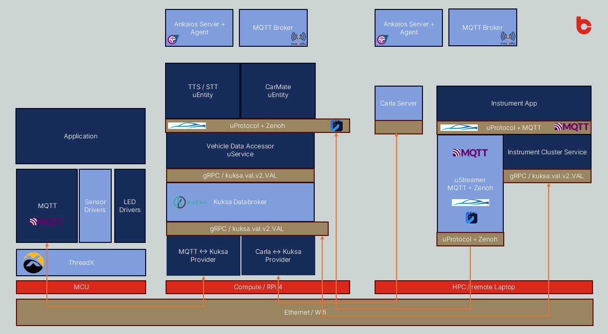

<!-- SPDX-License-Identifier: Apache-2.0 -->
# ArBytesMoral

# 1. Your Team at a Glance

## Team Name / Tagline  
ArBytesMoral – Mastering Every Byte with Passion, Dedication, and Team Spirit!

## Team Members  

| Name                   | GitHub Handle         | Role(s)                          | Email                              |
|------------------------|-----------------------|----------------------------------|------------------------------------|
| **Christopher Schwager** | `@cr1sschwager`      | Developer - Architecture / Pitch | christopher.schwager@carbyte.de   |
| **Nico Renner**        | `@RennerEngineering`  | Developer - TTS/STT / Pitch      |                                    |
| **Gabriel Böhn**       | `@gabriel-CBE`        | Developer - MCU                  |                                    |
| **Daniel Gerstle**     | `@gdaniel-cb`         | Developer - Carla                |                                    |
| **Jan Franck**         | `@Bert-Tec`           | Developer - LLM Integration      |                                    |

## Challenge  
SDV Lab Challange

## Core Idea  

### Problem Statement:  

Long drives can be lonely for truckers, commuters, and other drivers, leading to decreased motivation, engagement, and mental well-being. The absence of social interactions during prolonged drives contributes to fatigue and a disconnection from the outside world.  
Additionally, interacting with infotainment systems while driving can be risky due to physical distractions, posing safety concerns for drivers who need seamless, hands-free solutions.  

### Solution Idea:

Our solution introduces **CarMate**, an advanced AI-powered vehicle companion with its own mood and personality. It is designed to address both loneliness and safety for drivers. Here's how it works:

1. **AI-Powered Conversational Companion**:  
   - CarMate transforms the vehicle into a personalized and interactive companion, leveraging AI to simulate meaningful and engaging conversations.  
   - It offers social interactions and emotional support, reducing feelings of loneliness during long drives.  
   - The AI tailors its responses to the driver’s preferences and mood, creating a truly individualized experience.

2. **Access to Vehicle Data & Hands-Free Interaction for Safety**:  
   - CarMate seamlessly integrates with the vehicle's sensors and systems, accessing data such as speed, location, weather, and road conditions.  
   - This data enables CarMate to provide contextually relevant information (e.g., "It looks like rain ahead—drive safely!") and adapt interactions to the driving situation.  
   - To ensure safety and convenience, CarMate offers fully voice-enabled commands, eliminating the need for physical interaction with the infotainment system.  
   - Drivers can issue commands like:  
     - "Adjust the ambient lighting to blue."  
     - "Lower the temperature by 2°C."  
     - "What is the weather like at my destination?"  
   - The system leverages natural language understanding to provide seamless, intuitive communication and enhance the driving experience.  

### Benefits of CarMate:
- **Improved Driver Well-Being**: Reduces feelings of isolation with engaging conversations and emotional support.  
- **Enhanced Safety**: Eliminates physical distractions by offering a hands-free, voice-driven interface.  
- **Personalized Experience**: Tailors interactions and controls to the driver's preferences, making the vehicle feel like a true companion.  
- **Intelligent Assistance**: Supports the driver with real-time insights and recommendations based on vehicle and environmental data.  

In short, CarMate creates a safer, more social, and enjoyable driving experience for both truckers and commuters.

### Technical View

The following diagrams shows our target system architecture.

Vehicle Data Integration:
Sensor values from the MCU board (representing in-vehicle measurements such as temperature) and environmental sensor values provided by Carla are integrated into a unified vehicle data model. This data model is structured based on the Vehicle Signal Specification (VSS). To achieve this, providers for Carla and the MCU board will be added via MQTT protocols.

Voice Interaction:
On top of the vehicle data model, we will develop speech-to-text and text-to-speech applications to enable seamless, hands-free interaction between the driver and the system.

CarMate AI:
The CarMate application interprets the driver’s input through conversational AI. It interacts with the vehicle data model (e.g., for real-time data manipulation) or leverages an external Large Language Model (LLM) for more advanced queries and interactions.

Visual Display:
The cluster display is used to visualize data coming from Carla, as well as additional output generated by CarMate, providing drivers with intuitive and relevant information at a glance.

---

# 2. How Do You Work

## Development Process  
Our development process is structured into five distinct phases to ensure clarity, focus, and adaptability during the hackathon:

Phase 0: Ideation and Goal Setting
We begin as a whole group to brainstorm and define the core idea and the goal we want to achieve as a team during the hackathon.

Phase 1: Risk Identification and Initial Exploration
Potential risks, such as unfamiliar technologies or tools, are identified. To mitigate these risks, we conduct a short spike to explore and assess the unknown and risky aspects of the project.

Phase 2: Solution Design
Using the knowledge gained from the spike, we develop a system architecture diagram and a clear solution proposal to align the team on the technical approach.

Phase 3: Task Distribution and Iterative Development
Tasks are divided into manageable subtasks and distributed among team members as described in the Planning & Tracking section. The primary objective is to deliver a minimal, functional solution that can be incrementally extended as the hackathon progresses.

Phase 4: Pitch Preparation
The final phase focuses on preparing a polished and compelling pitch to present our solution effectively to the jury.

### Planning & Tracking  

Tasks are documented on Post-Its and assigned to team members.
During our regular group meetings (see Communication), current tasks are discussed, tracked, and redistributed as needed, with specific target deadlines being established.
If there are deviations from the schedule, we adjust by reprioritizing tasks, simplifying complex deliverables, or expanding scope depending on the context and necessity.

### Quality Assurance  
To ensure quality throughout the development process during the hackathon, we follow these principles:

Code-First Development and Early Integration:
We prioritize coding and integrating early to avoid last-minute incompatibilities and minimize time spent on non-functional parts. This ensures that progress is immediately tangible and functional.

Minimal and Necessary Documentation:
Essential documentation is added to the corresponding README.md files within the related folders. This keeps documentation concise and focused on usability and clarity.

Feature Branch Workflow with Quick Reviews:
Development is conducted on feature branches, and all changes are reviewed using the 4-eyes principle (peer review by at least one other team member) to quickly maintain code quality and catch potential issues early.

### Pull Request Template
> ## 🚀 Summary:  
> Briefly describe the purpose of this PR and what it accomplishes.
> 
> ## 🔍 Changes Made:  
> - Added feature X to module Y  
> - Refactored component Z for better performance  
> - Updated unit tests for A and B
> 
> ## 🧠 Reasoning: 
> Explain why these changes were necessary and what problem they solve.
> 
> ## 🛠️ Testing:
> - [ ] no testing needed (e.g. Readme)  
> - [ ] local testing  
> - [ ] some intergation tests  
> - [ ] full integration tests  
> 
> ## 📋 Checklist:
> - [ ] Code follows the project’s style guide  
> - [ ] Readme/Documentation updated  
> - [ ] Tested

###  Coding Style
- snake_case where possible
- Use meaningful variable, function, and type names. Avoid single-letter names unless in tight loops or mathematical contexts.
- Don’t explain the obvious. Instead, clarify intent, edge cases, or non-obvious decisions.
- Write concise, descriptive commit messages. Group related changes together.

## Communication  

We hold regular group meetings (approximately every 1-2 hours) to align on the current status of tasks and progress (Huddle Meetings).
Additionally, on-demand 1:1 discussions are initiated whenever necessary to resolve specific issues or clarify questions efficiently.

## Decision Making  

Our team strives to achieve decisions through consensus, ensuring that all voices are heard and a common agreement is reached. However, if consensus cannot be achieved within the limited time available, we resolve decisions through a democratic vote.

## 🧩 License

Licensed under the [Apache License 2.0](LICENSE).  
SPDX-License-Identifier: Apache-2.0

## 🤝 Contributing

Please see [CONTRIBUTING.md](CONTRIBUTING.md) and ensure compliance with the
[Eclipse Contributor Agreement (ECA)](https://www.eclipse.org/legal/ECA.php).

## 📄 Notice

See [NOTICE](NOTICE).

## © Copyright

Copyright (c) 2025 Eclipse Foundation and others.